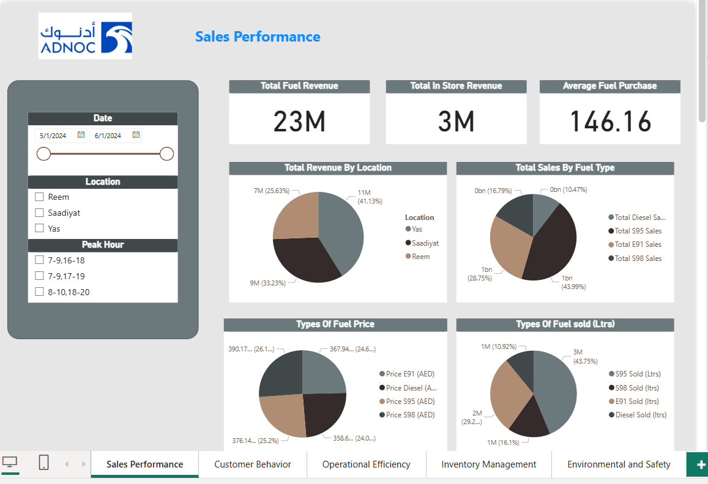
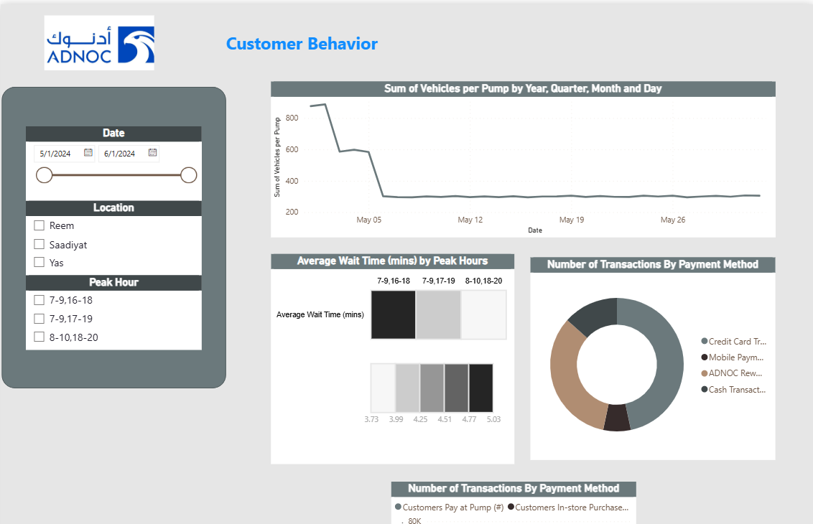
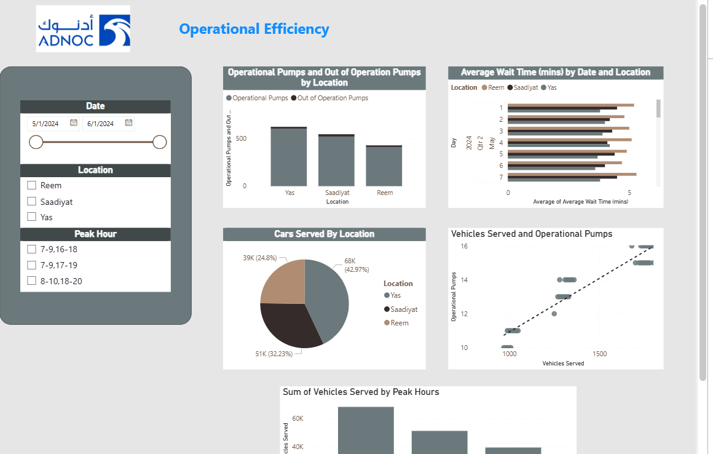

# ⛽ ADNOC Petrol Station Data Analysis – Power BI

An interactive Power BI dashboard analyzing **ADNOC petrol station data** including fuel sales, non-fuel retail, and customer behavior.  
This project highlights **business insights for energy & retail operations** using executive-style visuals.

---

## 📸 Dashboard Preview  

### Sales Overview

### Customer Insights

### Operational Insights

